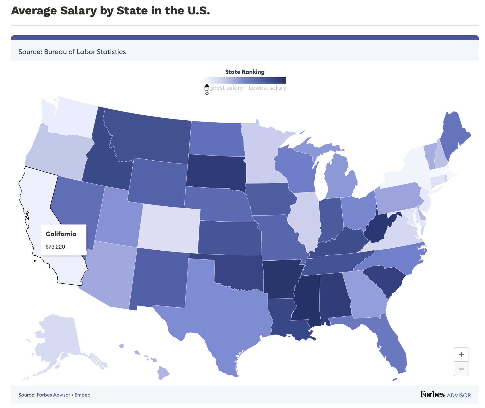

# Average Salary by State in the U.S. (2024)

This repository contains code in R to replicate the following graphic:

  

## Source

- Title: **Average Salary by State in the U.S.**

- Author(s): Belle Wong

- Date: Updated Sep 27, 2024

- From: Forbes

- URL:
  <https://www.forbes.com/advisor/business/average-salary-by-state/>

- PDF:
  [Average-Salary-By-State-Forbes.pdf](source/Average-Salary-By-State-Forbes.pdf)

## Data

Curated TSV file: [wage.tsv](wage.tsv)

  

In addition to the above TSV file, similar data is available in SoFi’s
article **Average US Salary by State** by Jacqueline DeMarco (last
update on Jan 28, 2025)

<https://www.sofi.com/learn/content/average-salary-in-us/>

Webpage accessed in Spring and Fall 2024, and also in Spring 2025.
